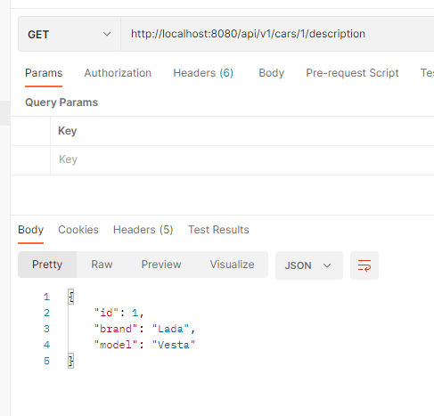
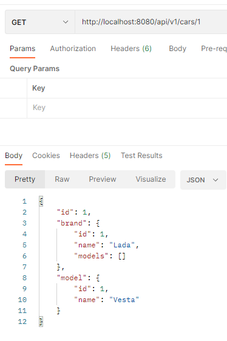
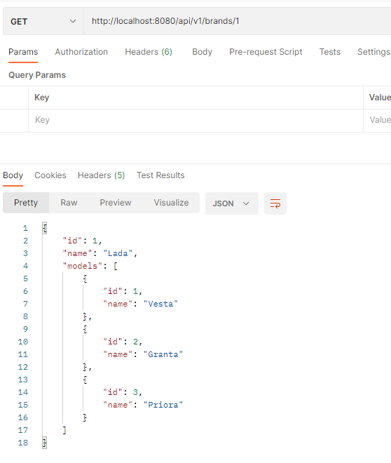
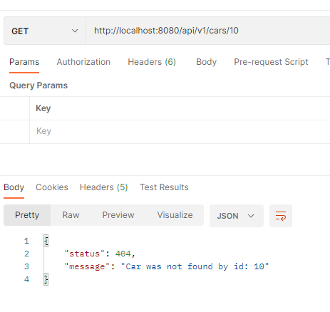
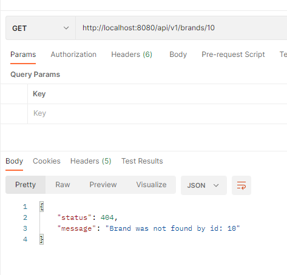

# webapi

##### Использовано в проекте:

- ***Kotlin***
- ***Spring Boot***
- ***JOOQ***
- ***Maven***
- ***Docker***

---

## О проекте.
### Микросервис, который позволяет пользователю получить информацию о выбранном (по ID) автомобилю через api метод /cars из базы данных в формате JSON.

---

Реализовано три эндпоинта:
* получение описание автомобиля по id

* получение полного описания автомобиля по id

* получение марки автомобиля по id

* в случае не найденных данных клиенту выдается сообщение

---

## Контакты.

***email:*** moroz.future@gmail.com
